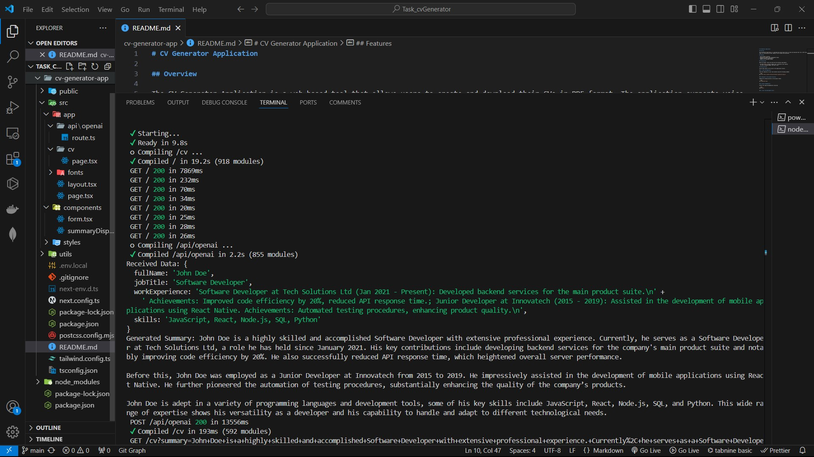

# CV Generator Application

## Overview

The CV Generator Application is a web-based tool that allows users to create and download their CVs in PDF format. The application supports voice input for collecting user data, making it user-friendly and accessible.

## Features

- User-friendly interface
- Detailed CV summary with customizable fields
- Dynamic preview of generated CV
- Exports CV in multiple formats

## Prerequisites

Before you begin, ensure you have met the following requirements:

- You have [Node.js](https://nodejs.org/) installed on your machine.
- You have a package manager like npm or yarn.

## Getting Started

Follow these steps to set up and run the application locally:

### 1. Clone the Repository

Clone the repository to your local machine using the following command:

```bash
git clone https://github.com/yourusername/cv-generator-app.git
```

### 2.Navigate to the project directory

Change your working directory to the project folder:

```bash
cd cv-generator-app
```

### 3.Install Dependencies

Install the required dependencies using npm:

```bash
npm install
```

### 4. Start the Development Server

Run the application in development mode:

```bash
npm start
```

### 5. Open your browser and go to http://localhost:3000 to view the application.

## Working Prototype

Here are some screenshots of the application in action:




## Demo Video

Watch a demo of the CV Generator App in action:


https://github.com/user-attachments/assets/60be023f-5e01-4545-9c75-5edc42f7873e


## Contributing

Contributions are welcome! Please follow these steps:

### 1.Fork the repository

### 2.Create a new branch:

```bash
git checkout -b feature-name
```

### 3. Make your changes and commit the changes:

```bash
git commit -m "Description of feature"
```

### 4. Push the branch:

```bash
git push origin feature-name
```

### 5.Open a Pull Request.

License
This project is licensed under the MIT License.
